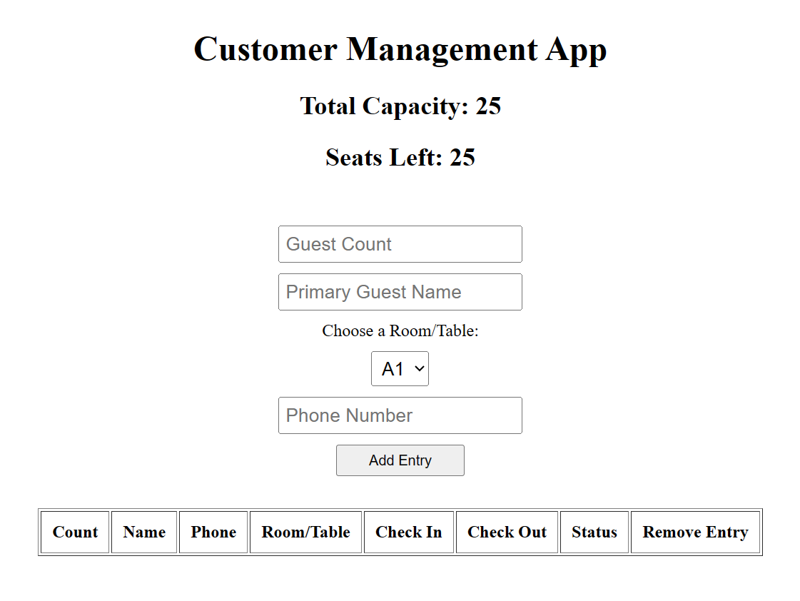

# Customer Management App

This repository contains a simple Customer Management App built using HTML, React, and JavaScript.

## Description

The Customer Management App helps manage guests in a dining establishment by allowing users to input guest information, allocate tables, and keep track of the seating capacity.

## Features

- **Input Form:** Allows users to add new guest entries, specifying guest count, name, phone number, and table preferences.
- **Table Display:** Displays a table with guest information including count, name, phone, room/table, check-in time, check-out functionality, and a delete option.
- **Capacity Management:** Tracks the total capacity and remaining seats, preventing overbooking.

## Usage

To use the app:

1. Open the `index.html` file in a web browser.
2. Fill in the required guest information in the input fields.
3. Choose a room/table from the dropdown menu.
4. Click on "Add Entry" to add the guest.
5. The table will display the added guest information along with options to check-out or remove an entry.

## How to Run

Simply open the `index.html` file in a web browser to launch the Customer Management App.

## Preview

## Dependencies

- React 18
- Babel Standalone

## Notes

- The app assumes a fixed number of tables and a total capacity of 25 guests.
- Guests can be checked out or removed from the list, updating the available seats accordingly.

## Credits

This app is created based on a sample.

Feel free to contribute, suggest improvements, or report issues by creating a pull request or raising an issue in this repository.

Happy managing your guests!
